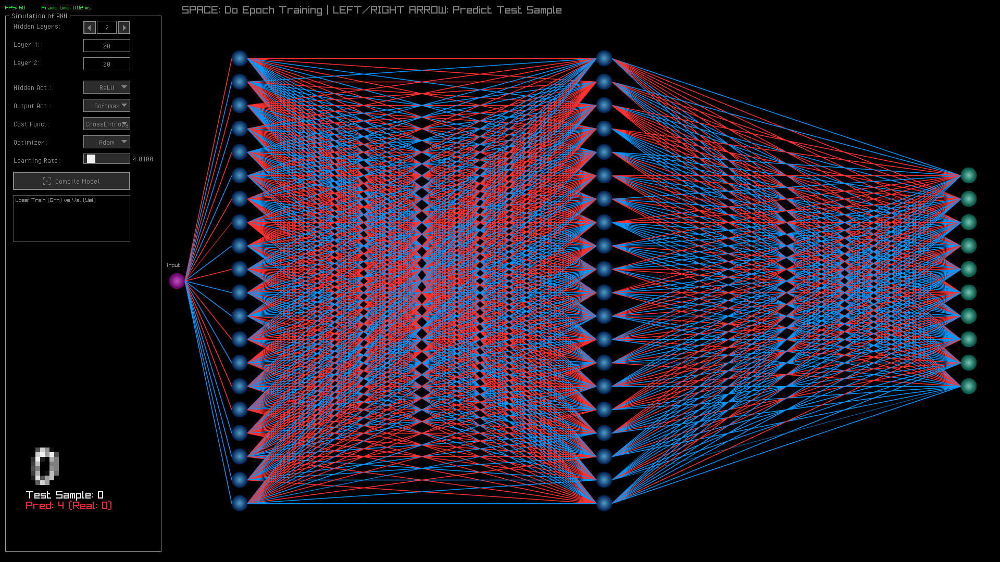
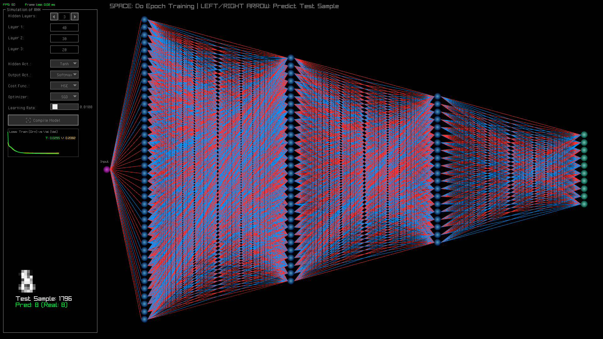
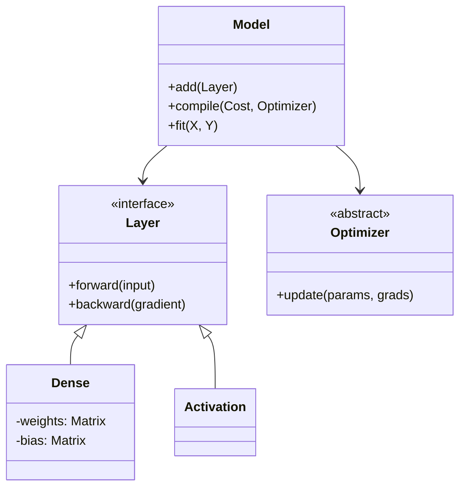

# ANN Learning Simulation & High-Perf C++ Engine

Este proyecto es una implementación dual: un motor de Deep Learning desarrollado desde cero (from scratch) en C++17 y una herramienta de simulación visual para observar la convergencia de redes neuronales en tiempo real.

A diferencia de los wrappers de frameworks existentes, este proyecto implementa su propio kernel de álgebra lineal y sistema de diferenciación automática.

## Visualización y Simulación

El proyecto incluye un módulo de interfaz gráfico basado en Raygui que permite visualizar la frontera de decisión de la red neuronal evolucionando durante el entrenamiento.

### Ejemplo de Red Inicial (Pesos Aleatorios)



### Ejemplo de Red Entrenada



## Arquitectura del Sistema

El código se estructura en tres capas de abstracción estrictas:

### Núcleo Matemático (`src/math/`)

El núcleo de cómputo no utiliza librerías externas como BLAS o Eigen. Implementa una clase `Matrix<T>` optimizada:

- Memory Layout: Almacenamiento Row-Major contiguo en un `std::vector<T>` plano para minimizar fallos de caché.

- Parallel Computing: Uso de directivas `#pragma omp parallel` for de OpenMP para vectorizar operaciones elementales (suma, producto Hadamard) y multiplicación de matrices ($O(n^3)$ paralelizado).

- Broadcasting: Soporte nativo para operaciones entre matrices y vectores sin copia de memoria.

## Neural Engine (src/nn/)

Framework modular inspirado en la API de Keras pero con gestión explícita de memoria:

- Grafo Computacional: Definido en `ops.h`. Cada operación (Forward) almacena caché necesario para el paso de gradiente (Backward).

- Optimizadores:
  - Adam: Implementación completa con corrección de sesgo para momentos $m_t$ y $v_t$.

  - SGD: Descenso de gradiente estocástico estándar.

- Inicializadores: Inicialización de pesos de Xavier implementada en `layers.h` para mantener la varianza de las activaciones.

## GUI & Control (`src/gui/`, `src/main.cpp`)

Loop principal de simulación que desacopla el renderizado (Raylib) del paso de entrenamiento.

## Detalles de Implementación

Jerarquía de Clases



## Stack Tecnológico

- **Lenguaje C++17** (Uso extensivo de `templates`, `std::shared_ptr` y `lambda functions`).

- **Build System** CMake 3.10+.

- Librerías:
  - OpenMP: Para multithreading en CPU.

  - Raylib: Para la ventana de visualización y input.

## Compilación e Instalación

Debido a la dependencia gráfica, es necesario tener las librerías de desarrollo instaladas.

### Instalar Dependencias (Ubuntu/Debian)

```
# Compilador y herramientas de construcción
sudo apt install build-essential git cmake

# OpenMP (generalmente incluido en GCC, pero verificamos)
sudo apt install libomp-dev

# Dependencias de Raylib (OpenGL, X11, etc.)
sudo apt install libasound2-dev libx11-dev libxrandr-dev libxi-dev libgl1-mesa-dev libglu1-mesa-dev libxcursor-dev libxinerama-dev
```

#### Construir el Proyecto

```bash
mkdir build && cd build

# Configurar con optimizaciones Release
cmake .. -DCMAKE_BUILD_TYPE=Release

# Compilar usando todos los núcleos disponibles
make -j$(nproc)
```

#### Ejecutar Simulación

```bash
./ANN_Learning_Simulation
```

## Ejemplo de Uso (API)

Aunque el `main.cpp` corre la simulación gráfica, la librería NN puede usarse independientemente (_headless_):

```cpp
#include "nn/model.h"
#include "nn/layers.h"

void train_headless() {
    // 1. Definir topología
    // Entrada: 2 neuronas, Oculta: 16 neuronas (ReLU), Salida: 1 neurona (Sigmoid)
    auto layers = std::make_shared<NN::Layer::Sequential<float>>();

    layers->add(std::make_shared<NN::Layer::Dense<float>>(2, 16)); // Infiere input
    layers->add(std::make_shared<NN::ActFunc::ReLU<float>>());
    layers->add(std::make_shared<NN::Layer::Dense<float>>(16, 1));
    layers->add(std::make_shared<NN::ActFunc::Sigmoid<float>>());

    // 2. Compilar Modelo
    NN::Model<float> model;
    model.set_layers(layers);

    // Optimizador Adam con Learning Rate 0.01
    auto optimizer = std::make_shared<NN::Optimizer::Adam<float>>(0.01f);
    auto cost = std::make_shared<NN::CostFunc::MSE<float>>(); // Mean Squared Error

    model.compile(cost, optimizer);

    // 3. Loop de Entrenamiento Manual (si no se usa fit())
    for(int epoch = 0; epoch < 1000; epoch++) {
        auto y_pred = model.forward(input_data);
        float loss = cost->calc(y_true, y_pred);

        model.backward(y_true, y_pred); // Backprop
        model.step(); // Update weights
    }
}
```

## Estructura de Archivos

- `src/math/matrix.h`: Definición de `Matrix<T>` y sobrecarga de operadores.

- `src/nn/layers.h`: Implementación de capas Dense y Sequential.

- `src/nn/optimizer.h`: Lógica de actualización de pesos (Adam/SGD).

- `include/raygui.h`: Header-only library para controles de UI inmediatos.

- `data/`: Datasets de prueba (ej. optdigits) en formato nativo.
